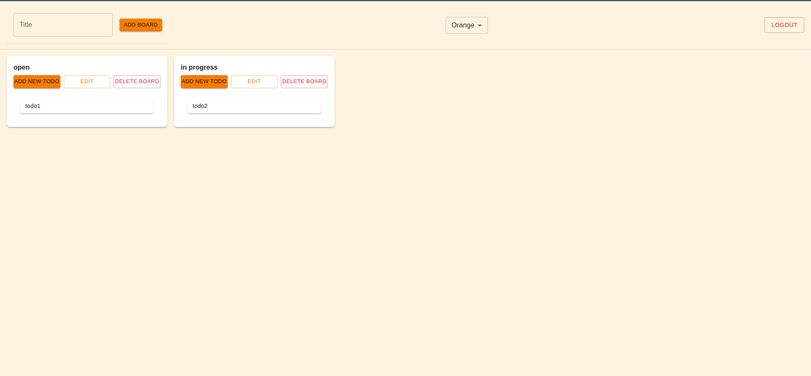

# TaskBoardApp

This project is a **full-stack task management web application** similar to issue boards used in tools like GitLab.  
It allows users to create boards and manage tasks by organizing them and marking them as completed.

The application consists of:

- **React frontend**
- **Java Spring Boot backend**
- **Dockerized backend deployment**

---

# Overview

The application provides a simple way to manage tasks using a **board-based workflow**.  
Users can register an account, create boards, and add tasks to those boards.

Each task can be tracked and marked as completed, allowing users to visually manage their work.

This project demonstrates the development of a **modern full-stack web application** with containerized backend deployment.

---

# Features

- User registration
- Create and manage task boards
- Add tasks to boards
- Mark tasks as completed
- Persistent backend storage
- Dockerized backend deployment

---

# Architecture

The system is composed of two main components:

## React Frontend

- Provides the user interface
- Handles user interactions
- Communicates with the backend through API requests

## Spring Boot Backend

- Implements REST APIs
- Handles business logic
- Manages user accounts, boards, and tasks

## Docker Deployment

- The backend is packaged and deployed using **Docker**
- Ensures consistent runtime environment and easier deployment

---

# Technologies

- **Java**
- **Spring Boot**
- **React**
- **Docker**
- **REST API architecture**

---

# Installation

## Requirements

- Node.js
- Java JDK
- Docker and Docker compose
- npm

## Setup

1. Clone the repository.

2. Start the backend using Docker:
```
docker compose build
docker compose up
```

3. Navigate to the `webapp` directory and install dependencies:

```
npm install
```

4. Start the React development server:

```
npm run start
```

5. Open the application in your browser.

---

# Screenshot




---

# Future Improvements

- Board sharing and collaboration
- Improved UI and responsiveness

---

# License

This project is open source and available for modification and distribution.